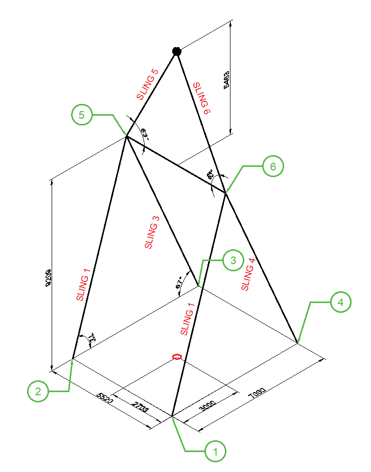

# Rigging Report

## 1. Pipe Weight Calculation

The weight of the spreader bar pipe is calculated as:

$$
\text{Weight per Meter} = \text{Outer Diameter} \times \pi \times \text{Thickness} \times 7.85
$$

$$
\text{Weight} = \text{Weight per Meter} \times \text{Length}
$$

The calculated weight of the spreader bar pipe is **2.28 T**.

## 2. Position of Center of Gravity (C.O.G)

The position of the C.O.G is essential for stability. The distances from the C.O.G to each lifting point are used in the load calculations.

## 3. Calculation for Each Lifting Point

The load at each lifting point is:

The load at each lifting point is calculated using  (.eg lifting point 1 and 2):

> - $
L = W \times \left( \frac{d_{t1}}{od_{t1}} \right) \times \left( \frac{d_{t2}}{od_{t2}} \right)
$
> - $
L1 = 150 \times \left( \frac{5520-2703}{5520} \right) \times \left( \frac{7000-3000}{7000} \right)
$
> - $
L2 = 150\times \left( \frac{2703}{5520} \right) \times \left( \frac{7000-3000}{7000} \right)
$

- Lifting Point 1: 43.74 T
- Lifting Point 2: 41.97 T
- Lifting Point 3: 31.48 T
- Lifting Point 4: 32.81 T
- Lifting Point 5: 76.55 T
- Lifting Point 6: 73.45 T

## 4. Tension Calculation

The tension in each sling is:

- $
\text{Tension} = \frac{\text{Load}}{\sin(\theta)}
$

- Sling 1: 45.99 T (72°)
- Sling 2: 44.13 T (72°)
- Sling 3: 34.20 T (67°)
- Sling 4: 35.64 T (67°)
- Sling 5: 82.44 T (63°)
- Sling 6: 85.91 T (63°)

## 5. Compressive Stress on the Spreader Bar

The compressive stress is:

- $
\text{Longitudinal Load} = \text{Load} \times \cos(\theta)
$

The total compressive stress on the spreader bar is **75.01 T**.

## 8. Summary Tables

### Lifting Load at 4 Lifting Points and Padeye

| Lifting Point | Load (T) |
| ------------- | -------- |
| 1             | 43.74    |
| 2             | 41.97    |
| 3             | 31.48    |
| 4             | 32.81    |
| Pu 1          | 76.55    |
| Pu 2          | 73.45    |

### Tension of the Slings

| Sling No. | Tension (T) | Angle (°) |
| --------- | ----------- | --------- |
| 1         | 45.99       | 72        |
| 2         | 44.13       | 72        |
| 3         | 34.20       | 67        |
| 4         | 35.64       | 67        |
| Slu2      | 82.44       | 63        |
| Slu1      | 85.91       | 63        |

### Upper Sling and Hook Load

| Component    | Load (T) |
| ------------ | -------- |
| Slu2 Tension | 82.44    |
| Slu1 Tension | 85.91    |
| Hook Load    | 159.99   |

### Compressive Stress on Spreader Bar

| Component                | Stress (T) |
| ------------------------ | ---------- |
| Total Compressive Stress | 75.01      |
